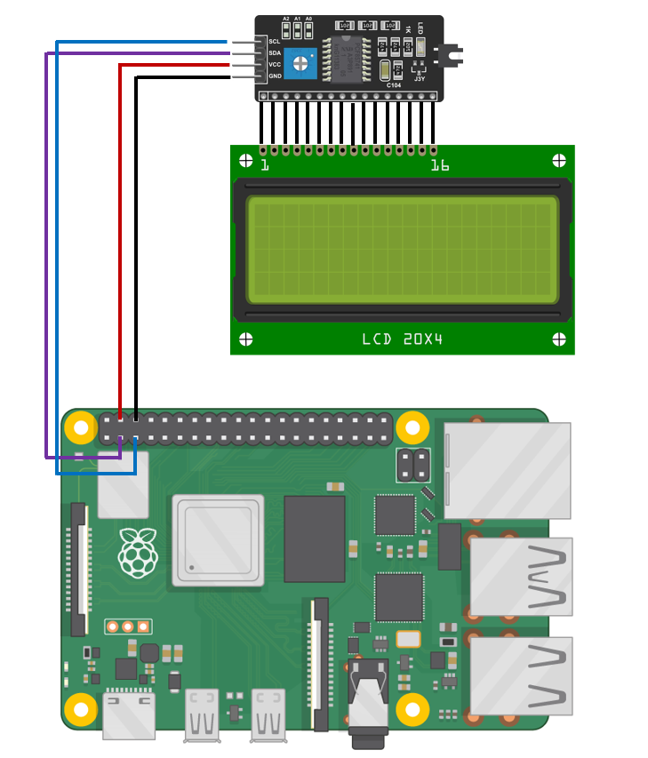

# myScanner

**myScanner** is small automatic USB drives antivirus scanner run on Raspberry Pi 4 with show informations and status on 20x4 I2C LCD display. On Raspberry Pi 4 runs Raspberry Pi OS Lite (64-bit) and ClamAV as antivirus.

**Work in progress**

* [Motivation](#motivation)
* [What you need](#what-you-need)
* [Wiring](#wiring)
* [Install](#install)
* [Contribute](#contribute)
* [Licenses](#licenses)

## Motivation

**Why I make this project?** In my company we have strict rules for USB drives. Before I use USB drive I must scann it for viruses. We have old (win) PC without connection to our network. But this "offline station" is very slow and used antivirus is outdated. That's why I make **myScanner** to replace old offline station. Is it Linux based, antivirus is updated and is it faster (compare with old pc).

## What you need

You need [Raspberry Pi 4](https://www.raspberrypi.com/products/raspberry-pi-4-model-b/) with [Raspberry Pi OS Lite (64-bit)](https://www.raspberrypi.com/software/) on SD CARD and [Power Supply](https://www.raspberrypi.com/products/type-c-power-supply/). Next you need 20x4 I2C LCD Display and custom enclosure for this project. I prepare STL files for 3D printed custom enclosure.

## Wiring

    

## Install

1. You need install [Raspberry Pi OS Lite (64-bit)](https://www.raspberrypi.com/software/) to SD CARD
2. Update OS with `sudo apt update` and `sudo apt full-upgrade --y`
3. Check `python3` version with `python3 --version` command on Terminal. If you don't have installed python3, you must install it with `sudo apt install python3`.
4. Install pip3 and git, if you don't have it with `sudo apt -y install python3-pip git-all` command.
5. Clone git repo with `git clone https://github.com/MartinIIoT/myScanner/ ~/myScanner/` command.
6. Goto `~/myScanner` folder with `cd ~/myScanner/` command and install packages with `python3 -m pip install -r requirements.txt` command.
7. Copy `myscanner.service` file to `/etc/systemd/system/` with `sudo cp ./myscanner.service /etc/systemd/system/` command.
8. Run service with `sudo systemctl start myscanner.service` command.
9. And get it to start on boot with `sudo systemctl enable myscanner.service` command.
10. **Happy scanning :)**

Note: If you have some problem, you are free to open issue.

## Licenses

* The GNU General Public License, version 3.0 or later
* Raspberry Pi is a trademark of Raspberry Pi Ltd.
