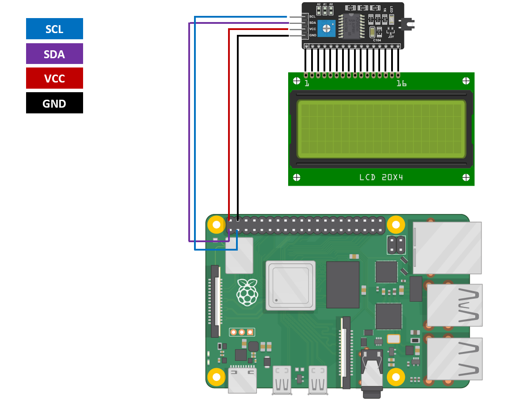

# myScanner

**myScanner** is small automatic USB drive antivirus scanner run on Raspberry Pi 4 with show informations and status on 20x4 I2C LCD display. On Raspberry Pi 4 runs Raspberry Pi OS Lite (64-bit) and ClamAV as antivirus.

**Work in progress**

* [Motivation](#motivation)
* [What you need](#what-you-need)
* [Wiring](#wiring)
* [Development](#development)
  * [Requirements - Hardware](#requirements---hardware)
  * [How to build](#dev-build)
  * [Linter](#dev-linter)
* [License](#license)

## Motivation

**Why I make this project?** In my company we have strict rules for USB drives. Before I use USB drive I must scann it for viruses. We have old (win) PC without connection to our network. But this "offline station" is very slow and used antivirus is outdate. Then I make **myScanner** to replace old offline station. Is it Linux based, antivirus is update and is it faster (compare with old pc).

## What you need

You need [Raspberry Pi 4](https://www.raspberrypi.com/products/raspberry-pi-4-model-b/) with [Raspberry Pi OS Lite (64-bit)](https://www.raspberrypi.com/software/) on SD CARD and [Power Supply](https://www.raspberrypi.com/products/type-c-power-supply/). Next you need 20x4 I2C LCD Display and in ideal world case for this project. I prepare STL files for 3D printed custom case.

## Wiring

    

### License

* The GNU General Public License, version 3.0 or later
* Raspberry Pi is a trademark of Raspberry Pi Ltd.
